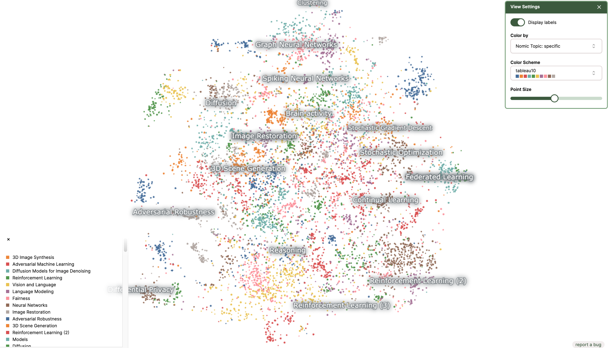
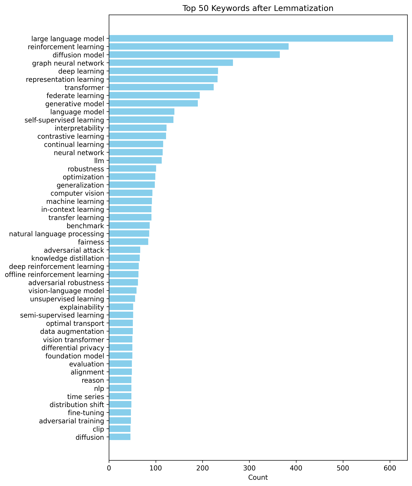
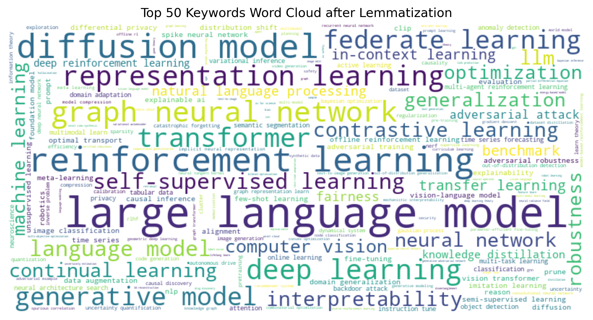

# ICLR 2024 OpenReivew Submission Data

This repository contains the downloading and parsing code for the ICLR 2024 OpenReview data. The data is downloaded from the [ICLR 2024 OpenReview website](https://openreview.net/group?id=ICLR.cc/2024/Conference) with the [OpenReview API](https://docs.openreview.net/reference/api-v2/).

## Data
- [`raw_paperlist.json`](https://github.com/ranpox/iclr2024-openreview-submissions/releases/download/v0.1/raw_paperlist.json): The raw data of the ICLR 2024 paper list.
- [`raw_paper_reviews.jsonl`](https://github.com/ranpox/iclr2024-openreview-submissions/releases/download/v0.2/raw_paper_reviews.jsonl): The raw data of the ICLR 2024 paper reviews.
- [`iclr2024_papers.csv`](data/iclr2024_papers.csv): The parsed ICLR 2024 CSV data contains `id`, `title`, `abstract`, `primary_area`, `keywords`, and `tldr`. Note: You can use ChatGPT code interpreter to analyze this file.
- [`iclr2024_reviews_20231110.csv`](./data/iclr2024_reviews_20231110.csv): The parsed ICLR 2024 reviews CSV data contains ID, Title, Average Score, Standard Deviation, and Individual Scores. The list is sorted by the average score and the standard deviation.

## Visualizations

### Interactive Visualization [[Link](https://atlas.nomic.ai/map/9ec8512c-cec0-4b1b-b7f8-14abbad52e8a/20c9a572-e9b9-4188-89f4-eeb9005353e3)]

You can use the interactive visualization to explore the ICLR 2024 submissions. The visualization is powered by [Nomic Atlas](https://atlas.nomic.ai/).

### Top 50 Keywords Bar Chart

### Top 50 Keywords Word Cloud
